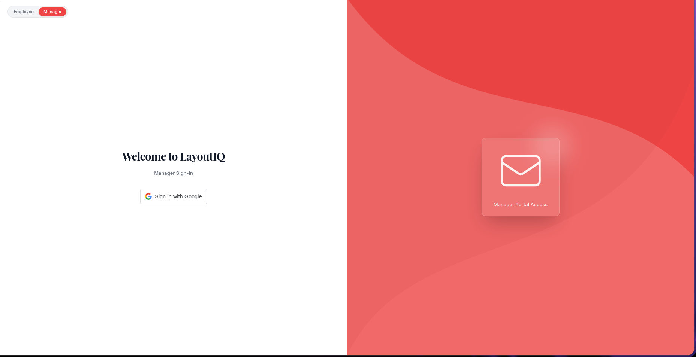
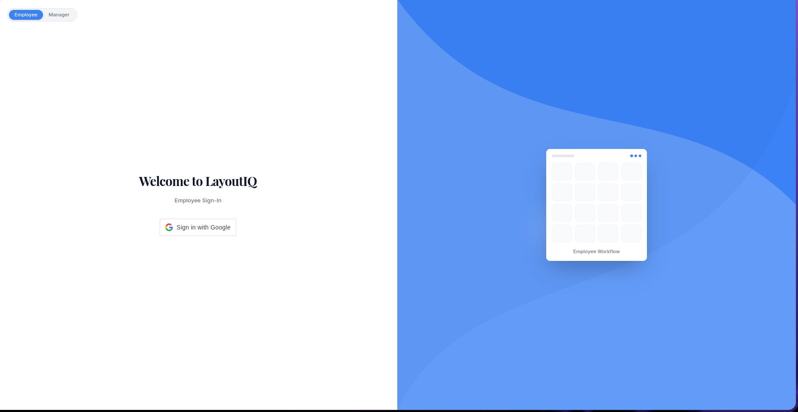
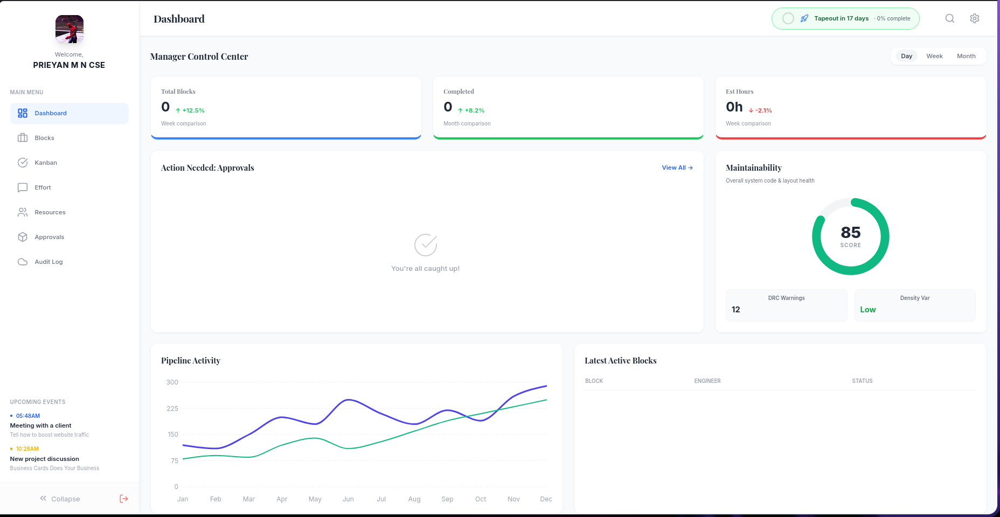
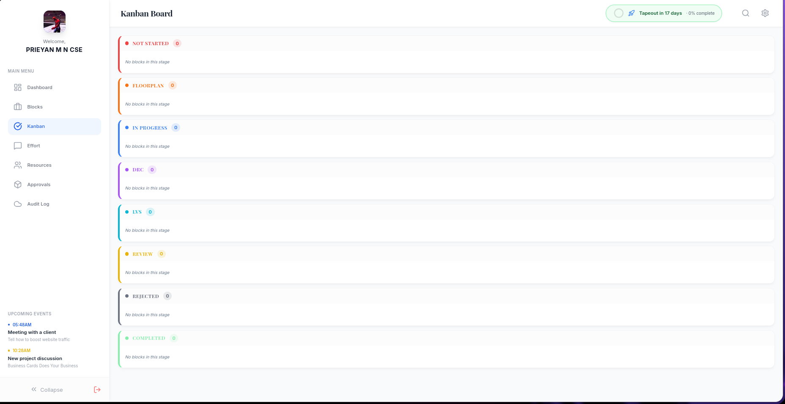
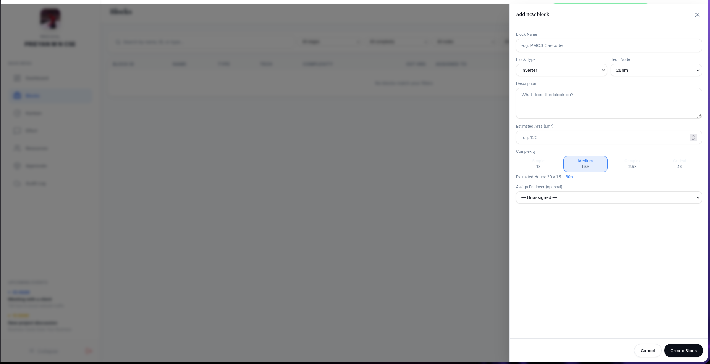
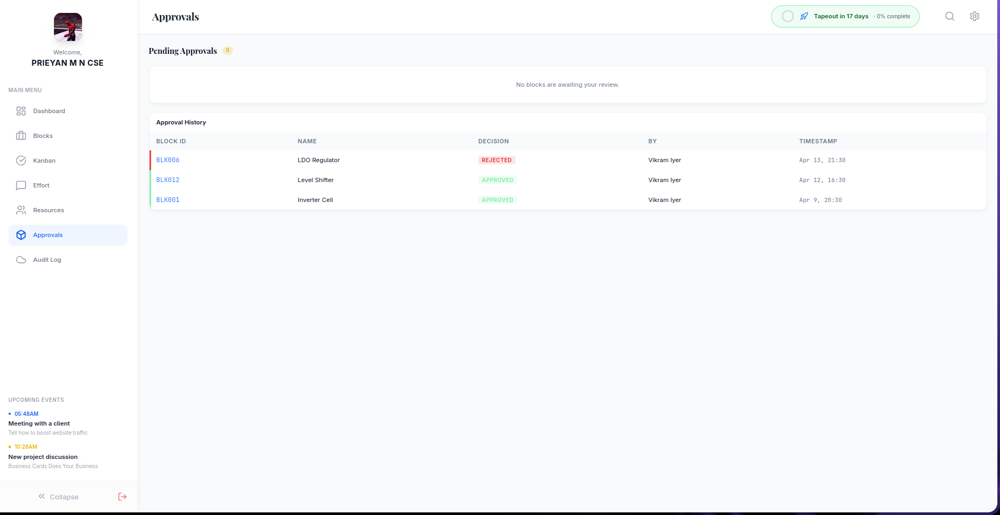
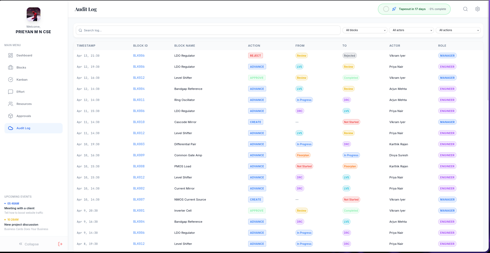
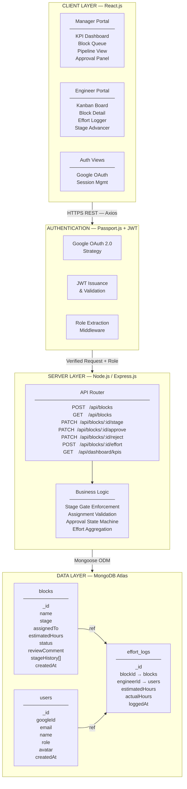
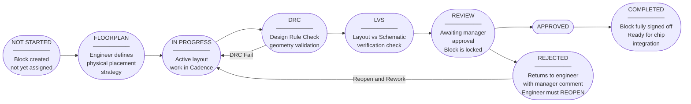

<p align="center">
  
</p>

<h1 align="center">VLSI/ASIC Design Workflow Management System</h1>

<p align="center">
  A domain-specific project management platform engineered for semiconductor physical design teams.
  <br />
  Built to replace spreadsheet-driven coordination with a structured, real-time, role-aware workflow engine.
</p>

<p align="center">
  
  
  
  
  
</p>

---

## Table of Contents

- [Project Title & Team](#project-title--team)
- [Problem Statement](#problem-statement)
- [Application Flow](#application-flow)
- [Tech Stack](#tech-stack)
- [UI Screenshots](#ui-screenshots)
- [Features Implemented](#features-implemented)
- [System Architecture](#system-architecture)
- [Block Lifecycle](#block-lifecycle)
- [Project Structure](#project-structure)
- [Getting Started](#getting-started)
- [Environment Variables](#environment-variables)
- [API Reference](#api-reference)
- [Role-Based Access Control](#role-based-access-control)
- [Known Issues / Limitations](#known-issues--limitations)

---

## Project Title & Team

**Project:** VLSI/ASIC Design Workflow Management System

**Team Name:** tech_rockers

**Hackathon:** Epic Buildathon

| Role | Name |
|---|---|
| Team Lead | *(add name)* |
| Member | *(add name)* |
| Member | *(add name)* |

> **Institution:** *(add institution name)*

---

## Problem Statement

In semiconductor chip design (VLSI/ASIC), the physical layout of a microchip is divided into many discrete architectural blocks. Each block must be meticulously designed and pass stringent verification checks — including Design Rule Checks (DRC) and Layout Versus Schematic (LVS) — before the entire chip can be integrated and submitted for fabrication.

Large engineering teams currently manage all coordination through shared Excel files and email threads. This approach creates four systemic failures at scale:

| Problem | Impact |
|---|---|
| No real-time pipeline visibility | Blocks stall silently at DRC or LVS with no automated alerting |
| Disconnected effort tracking | Estimated vs. actual hours are not tied to design artifacts; capacity planning is imprecise |
| Fragmented approval processes | Manager sign-offs happen over email, creating untraceable bottlenecks |
| Resource misallocation | No mechanism to detect double-assignment or identify unassigned critical blocks |

Generic tools such as Jira or Trello lack the domain-specific vocabulary and workflow enforcement required for physical design work. This platform replaces spreadsheet-driven coordination with a purpose-built system that speaks the language of semiconductor engineers while giving managers real-time visibility into pipeline health, resource allocation, and critical delays.

---

## Application Flow

### Step 1 — Authentication
Both managers and engineers log in via **Google OAuth 2.0**. On first login, an account is created and a role is assigned. A JWT is issued for all subsequent API calls.

### Step 2 — Role-Based Dashboard Routing
| Role | Landing Page |
|---|---|
| Manager | KPI Dashboard — aggregate metrics, pipeline health, block queue |
| Engineer | Filtered Kanban Board — only their assigned blocks |

### Step 3 — Block Creation & Assignment (Manager)
The manager creates a design block (e.g. `ALU_CORE`, `MEM_CTRL`) and assigns it to an engineer with an estimated hours budget.

### Step 4 — Stage Advancement (Engineer)
The engineer works through the ordered pipeline:
```
NOT STARTED → FLOORPLAN → IN PROGRESS → DRC → LVS → REVIEW
```
Each transition is timestamped and logged in `stageHistory`. Stages cannot be skipped — this is enforced at the API layer.

### Step 5 — Effort Logging (Engineer)
At any stage, the engineer logs actual hours worked against the manager-set estimate. This powers the estimated vs. actual hours KPI on the manager dashboard.

### Step 6 — Submit for Review (Engineer)
Once LVS is complete, the engineer submits the block for manager review. The block is **locked** — no edits are possible until the manager acts.

### Step 7 — Approval Decision (Manager)
The manager reviews the block from the Approval Panel:
- **Approve** → Block moves to `COMPLETED` and is ready for chip integration.
- **Reject** → A comment is required. The block returns to the engineer's queue with feedback attached.

### Step 8 — Rework (Engineer, if rejected)
The engineer reads the manager's comment, reopens the block, and resumes work from the `IN PROGRESS` stage.

---

## Tech Stack

| Layer | Technology | Purpose |
|---|---|---|
| Frontend | React.js 18 | Component-based UI, role-aware rendering |
| State Management | React Context API | Global auth state and user session |
| HTTP Client | Axios | REST API communication with interceptors |
| Backend | Node.js v20 + Express.js | REST API server, middleware pipeline |
| Authentication | Passport.js + Google OAuth 2.0 | Identity verification and session management |
| Authorization | JWT (JSON Web Tokens) | Stateless role-based route protection |
| Database | MongoDB Atlas | Document storage for blocks, users, effort logs |
| ODM | Mongoose | Schema enforcement and query abstraction |
| Styling | Tailwind CSS | Utility-first UI styling |
| Build Tool | Vite | Frontend dev server and bundler |
| Language | TypeScript | Type-safe frontend development |
| Environment | dotenv | Secrets and configuration management |

---

## UI Screenshots

| Page | Description | Screenshot |
|---|---|---|
| **Manager Login** | Google OAuth entry point for managers |  |
| **Employee Login** | Google OAuth entry point for engineers |  |
| **Manager Dashboard** | KPI metrics — active blocks, hours, pipeline summary |  |
| **Kanban Board** | Engineer's stage-gated block view |  |
| **Add Block** | Manager creates a new design block and assigns engineer |  |
| **Approval Status** | Manager reviews and approves/rejects submitted blocks |  |
| **Effort Logs** | Engineer logs actual hours against estimated hours |  |

---

## Features Implemented

### Mandatory Modules

| # | Module | Status |
|---|---|---|
| 1 | **Google OAuth 2.0 Authentication** — login, JWT issuance, role-based session | ✅ Complete |
| 2 | **Role-Based Access Control** — Engineer and Manager roles with route guards | ✅ Complete |
| 3 | **Block Lifecycle Management** — stage-gated pipeline (NOT STARTED → COMPLETED) | ✅ Complete |
| 4 | **Effort Logging** — actual vs. estimated hours tracked per block per engineer | ✅ Complete |
| 5 | **Manager Approval Workflow** — submit, approve, reject with required comments | ✅ Complete |
| 6 | **KPI Dashboard** — real-time aggregate metrics for managers | ✅ Complete |

### Additional Features

- `stageHistory` — every stage transition is timestamped and stored on the block document
- Block locking — blocks are read-only while in REVIEW, preventing race conditions
- Reopen flow — rejected blocks require an explicit reopen action before rework
- DRC fail loop — blocks can cycle back from DRC to IN PROGRESS without penalty
- Filtered views — engineers only see their assigned blocks; managers see all
- Assignment panel — managers can reassign blocks and update estimated hours

---

## System Architecture

The system follows a three-tier MERN architecture with a dedicated authentication layer using Google OAuth 2.0 and role-based middleware protecting all API routes.



### Tier Responsibilities

| Tier | Technology | Responsibility |
|---|---|---|
| Client | React.js + Context API | Role-aware UI rendering, HTTP communication via Axios |
| Auth | Passport.js + JWT | Google identity verification, token issuance, role-based route guards |
| Server | Node.js + Express.js | Business logic, stage gate enforcement, approval state machine |
| Data | MongoDB + Mongoose | Persistent storage of blocks, users, and effort logs with schema validation |

---

## Block Lifecycle

Every design block moves through a strict, ordered pipeline. Stages cannot be skipped. The state machine is enforced at the API layer.



---

## Project Structure

```
vlsi-workflow-system/
|
+-- client/                          # React.js frontend (TypeScript + Vite)
|   +-- public/
|   |   +-- index.html
|   +-- src/
|       +-- assets/
|       |   +-- banner.png
|       +-- components/
|       |   +-- Board/               # Kanban board components
|       |   +-- Dashboard/           # KPI and analytics panels
|       |   +-- Block/               # Block detail and stage controls
|       |   +-- Common/              # Shared UI components
|       +-- context/
|       |   +-- AuthContext.js       # Global authentication state
|       +-- hooks/
|       |   +-- useBlocks.js
|       |   +-- useEffortLog.js
|       +-- pages/
|       |   +-- ManagerDashboard.jsx
|       |   +-- EngineerDashboard.jsx
|       |   +-- Login.jsx
|       +-- services/
|       |   +-- api.js               # Axios instance with auth headers
|       +-- App.jsx
|       +-- main.jsx
|
+-- server/                          # Node.js / Express backend
|   +-- config/
|   |   +-- passport.js              # Google OAuth strategy
|   |   +-- db.js                    # MongoDB connection
|   +-- controllers/
|   |   +-- blockController.js
|   |   +-- userController.js
|   |   +-- dashboardController.js
|   +-- middleware/
|   |   +-- authenticate.js          # JWT verification
|   |   +-- authorize.js             # Role-based access guard
|   +-- models/
|   |   +-- Block.js
|   |   +-- User.js
|   |   +-- EffortLog.js
|   +-- routes/
|   |   +-- auth.js
|   |   +-- blocks.js
|   |   +-- users.js
|   |   +-- dashboard.js
|   +-- utils/
|   |   +-- stageValidator.js        # Stage transition enforcement
|   +-- app.js
|   +-- server.js
|
+-- assets/                          # Screenshots and banner images
+-- .env.example
+-- .gitignore
+-- package.json
+-- README.md
```

---

## Getting Started

### Prerequisites

- Node.js >= 18.x (v20 recommended)
- npm >= 9.x
- MongoDB Atlas account (or local MongoDB instance)
- Google Cloud Console project with OAuth 2.0 credentials

### Installation

1. Clone the repository:

```bash
git clone https://github.com/tech-rockers/vlsi-workflow-system.git
cd vlsi-workflow-system
```

2. Install server dependencies:

```bash
cd server
npm install
```

3. Install client dependencies:

```bash
cd ../client
npm install
```

4. Configure environment variables:

```bash
cp .env.example .env
# Edit .env with your credentials — see Environment Variables section below
```

5. Start the development servers:

```bash
# Terminal 1 — Backend
cd server
npm run dev

# Terminal 2 — Frontend
cd client
npm run dev
```

The client will be available at `http://localhost:5173` and the API server at `http://localhost:5000`.

---

## Environment Variables

Create a `.env` file in the `/server` directory based on `.env.example`. **Never commit real credentials.**

```env
# .env.example

# Server
PORT=5000
NODE_ENV=development

# MongoDB
MONGO_URI=mongodb+srv://<username>:<password>@cluster.mongodb.net/vlsi-workflow

# Google OAuth 2.0
# Create credentials at: https://console.cloud.google.com/apis/credentials
GOOGLE_CLIENT_ID=your_google_client_id
GOOGLE_CLIENT_SECRET=your_google_client_secret
GOOGLE_CALLBACK_URL=http://localhost:5000/api/auth/google/callback

# JWT
JWT_SECRET=your_jwt_secret_key
JWT_EXPIRES_IN=7d

# Client Origin (for CORS)
CLIENT_ORIGIN=http://localhost:5173
```

> **For judges:** Copy `.env.example` to `.env` and fill in your own Google OAuth credentials and MongoDB URI. No real values are committed to this repository.

---

## API Reference

All routes are prefixed with `/api`. Protected routes require a valid JWT in the `Authorization: Bearer <token>` header.

| Method | Endpoint | Role Required | Description |
|---|---|---|---|
| GET | `/auth/google` | Public | Initiate Google OAuth flow |
| GET | `/auth/google/callback` | Public | OAuth callback, returns JWT |
| GET | `/blocks` | Engineer, Manager | List all blocks (filtered by role) |
| POST | `/blocks` | Manager | Create a new design block |
| GET | `/blocks/:id` | Engineer, Manager | Get single block detail |
| PATCH | `/blocks/:id/assign` | Manager | Assign engineer and set estimated hours |
| PATCH | `/blocks/:id/stage` | Engineer | Advance block to next stage |
| POST | `/blocks/:id/effort` | Engineer | Log actual hours against estimate |
| PATCH | `/blocks/:id/submit` | Engineer | Submit block for manager review |
| PATCH | `/blocks/:id/reopen` | Engineer | Reopen a rejected block |
| PATCH | `/blocks/:id/approve` | Manager | Approve block, mark as completed |
| PATCH | `/blocks/:id/reject` | Manager | Reject block with required comment |
| GET | `/dashboard/kpis` | Manager | Aggregate KPI metrics |
| GET | `/users` | Manager | List all engineers |

---

## Role-Based Access Control

Two roles are supported. Role assignment is determined at account creation and stored on the user document.

| Capability | Engineer | Manager |
|---|---|---|
| View own assigned blocks | ✅ | ✅ |
| View all blocks | ❌ | ✅ |
| Create blocks | ❌ | ✅ |
| Assign engineers to blocks | ❌ | ✅ |
| Advance block stage | ✅ | ❌ |
| Log effort hours | ✅ | ❌ |
| Submit block for review | ✅ | ❌ |
| Approve or reject blocks | ❌ | ✅ |
| Access KPI dashboard | ❌ | ✅ |
| View all engineers | ❌ | ✅ |

---

## Known Issues / Limitations

- Role assignment is currently manual (set directly in the database). A self-serve role selection UI on first login is planned but not yet implemented.
- The KPI dashboard does not yet support date-range filtering; all metrics are computed over the full dataset.
- Email or in-app notifications when a block is submitted for review or rejected are not yet implemented.
- No pagination on the block list endpoint; performance may degrade with very large datasets.
- The DRC fail loop (DRC → IN PROGRESS) does not yet enforce a maximum retry count.

---

## Team

**tech_rockers** — Epic Buildathon Hackathon

---

<p align="center">
  Developed by <strong>tech_rockers</strong>
</p>